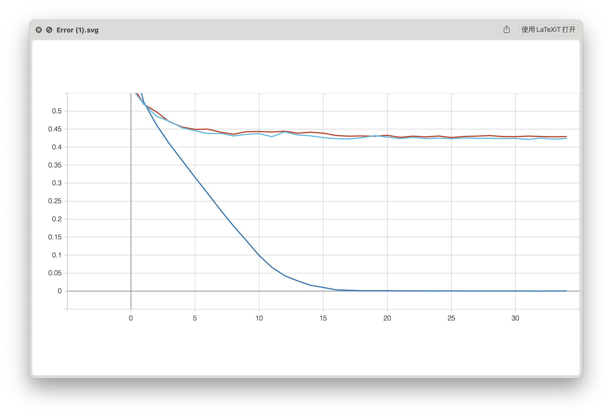
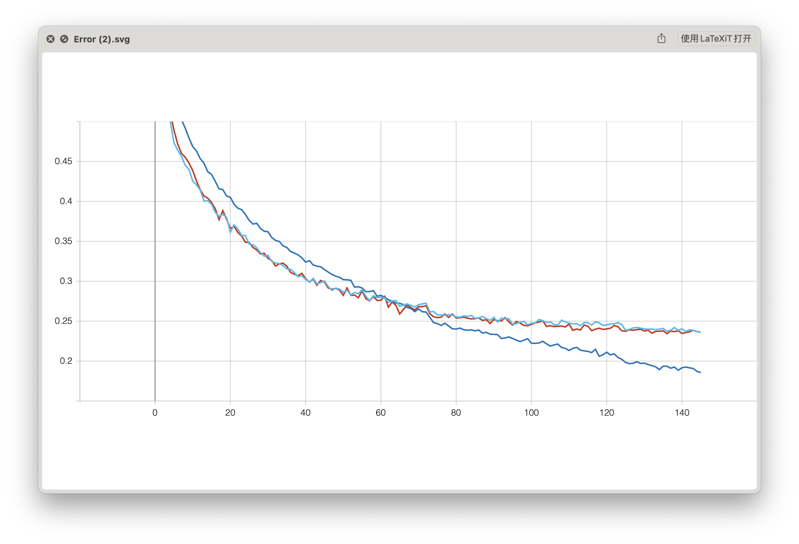
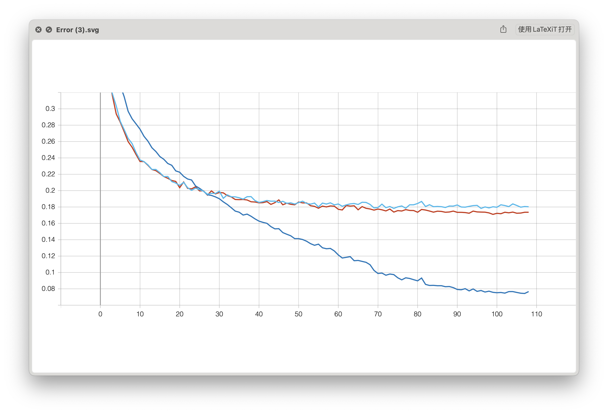
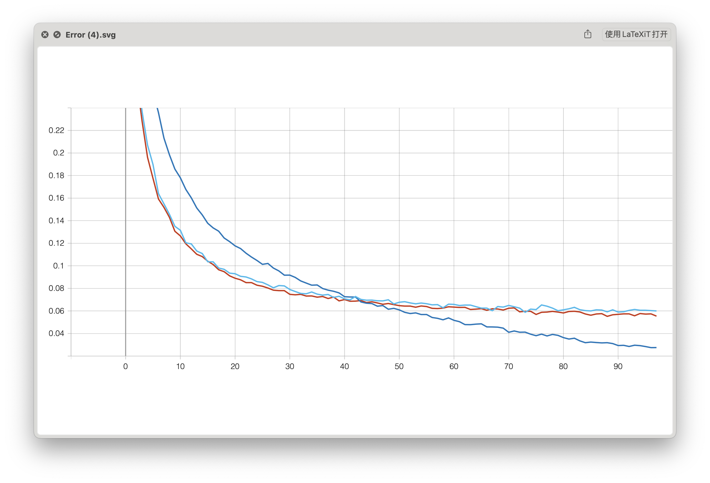

# 以resnet18分类cifar10为例，训练一个神经网络
### ——早期人类驯服神经网络实录
本实验基本设置如下：
+ 用`resnet18`网络分类`cifar10`
+ 超参数通过`optuna`搜索调整，选择最好的结果
+ 根据多次实验，选择`SGD`和`ReduceLROnPlateau`这一对`optimizer`和`lr_scheduler`组合

#### 1. 最基本的训练
效果极差，训练集上拟合很好，验证集和测试集上基本没效果。**测试错误率：0.4233**。


#### 2. 加入数据增强
这里有一点小的技巧。如果直接简单地用下面的代码进行数据增强，会导致从划分验证集时，验证集也被数据增强，验证时候不准，反而有负效果。
``` python
# 训练集上的数据增强
transform_train = ...
# 测试集通常不进行数据增强，只进行必要的预处理和标准化
transform_test = ...

from torchvision.datasets import CIFAR10
trainset = CIFAR10(root=root, train=True, download=True, transform=transform_train)
testset = CIFAR10(root=root, train=False, download=True, transform=transform_test)
```

因此，数据增强应该在划分完验证集（如果是遗忘的重训练，则是划分完遗忘集和验证集）之后再进行。但是因为我们采取了`torch.utils.data.Subset`方法来从原始的`trainset`中划分出上述的集合，而`Subset`没有办法简单地设置`transform`。根据ChatGPT的建议，选择改进`Dataloader`中的`collate`函数，在其中加上`transform`，得到如下代码
``` python
def train_collate_fn(batch):
    batch = [(transform_train(x[0]), x[1]) for x in batch]  # 应用训练集转换
    return default_collate(batch)

# 在原来的loader模块中
self.loader_dict["train"] = DataLoader(
        # 其它参数
        collate_fn=train_collate_fn
    )
```
还有额外的几个使用ChatGPT辅助编程的技巧：
+ 最开始ChatGPT建议设置`Subset`的`transform`属性，但是实验证明这并没有起效果，主要原因在于`Subset`的`__getitem__`是直接回到原数据集中取值的，它始终只会应用原数据集的`transform`。
+ 当指出ChatGPT的错误时，他可能只会简单更正错误，而不会注意到更正错误这一行为带来的后续逻辑错误。这可能和ChatGPT的生成机制有关。
+ ChatGPT往往提供多种可行方案，可以通过实验来选择其中效果最好的一种。（有时候选择太多反而是个麻烦）

可以注意到，这时训练集上的收敛速度会慢得多，但是学习的效果仍不太理想。**测试错误率：0.2386**。


#### 3. 从预训练模型微调
在`torchvision.models`中，提供了在`imagenet`一个子集上预训练的`resnet18`参数，若用这些参数微调得到`cifar10`上的模型，将会大大加快训练速度，并有可能提高分类准确率。微调有两种思路：
1. 以较小的学习率在`cifar10`上进一步训练模型
2. 冻结部分层，仅训练模型剩下的层

后一种方法需要做实验来选择冻结的层。由于前一种方法操作比较简单，并且已经取得了较好的效果，就没有再尝试后一种方法。

这时训练的速度快了很多，并且准确率有提升。**测试错误率：0.1803**。至此，我能想到的改进方法已经都使用了，接下来的性能提升是在ChatGPT的帮助下完成。


#### 4.1. 调整模型结构
ChatGPT指出，`torchvision.models.resnet18`是为尺寸较大的图片（如$224\times224$）设计的，`cifar10`图片的尺寸仅为$32\times32$，因此对模型结构做如下的调整:
> ResNet18的**第一个卷积层**通常设置为处理较大的图像，比如224x224像素，参数可能是7x7的卷积核，步长（stride）为2，填充（padding）为3。针对CIFAR-10数据集，你可以这样修改：
> + 卷积核大小：可以改为3x3或5x5，这样可以减少感受野的大小，更适合小尺寸图像。
> + 步长：步长可以减少到1，以避免在图像的初始卷积中丢失过多信息。
> + 填充：根据卷积核大小调整填充，以保持图像维度。例如，如果使用3x3卷积核，可能会使用1的填充。
>
> ResNet18的标准架构在第一个卷积层后有一个**最大池化层**，这在处理大尺寸图像时是有用的，因为它可以减少特征图的维度，减少计算量。但是对于CIFAR-10这样的小图像，这一层可能会导致过多的信息丢失。因此，你可以考虑移除这个最大池化层。

``` python
# 修改第一个卷积层
resnet18.conv1 = nn.Conv2d(3, 64, kernel_size=3, stride=1, padding=1, bias=False)

# 移除最大池化层
resnet18.maxpool = nn.Identity()
```
同时，可以添加`Dropout`层，以增加正则化。对于`resnet18`，`dropout`通常被添加到全连接层之前。
``` python
# 假设我们想要在最后的全连接层之前添加dropout
num_ftrs = resnet18.fc.in_features  # 获取全连接层的输入特征数量

# 创建一个新的全连接层，其中包含dropout
# 这里我们创建一个Sequential模块，包含dropout层和原始的全连接层
resnet18.fc = nn.Sequential(
    nn.Dropout(0.5),  # 添加dropout，丢弃率为0.5
    nn.Linear(num_ftrs, resnet18.fc.out_features)
)
```
此时模型已经可以取得非常好的效果。**测试错误率：0.0592**。


#### 4.2. 扩大cifar10图片尺寸
除了修改模型以适应`cifar10`尺寸，也可以扩大`cifar10`尺寸以适应模型。需要注意两点：
+ 这一步应当对训练集和测试集都进行，相当于在`cifar10`基础上创造一个全新的数据集。
+ 由于这一步只需要进行一次，因此可以在数据预处理时进行，并将扩大尺寸的图片保存下来以备访问。

代码实现上只需要利用`transforms.Resize`即可：
``` python
transform_train = transforms.Compose(
    [
        transforms.Resize((224,224))
        # 其它transform操作
    ]
)
```
在实际操作中会发现，$224\times224$尺寸的PIL图片在用`ToTensor()`转为张量的过程中，会消耗非常大的cpu资源（设置`batchsize=128`时，在22服务器上会占用60-80个核），严重拖慢训练进度，影响服务器正常使用。由于这一方法与[4.1](#41-调整模型结构)相比取得的结果类似，故采取更高效的调整模型结构这一方法。
