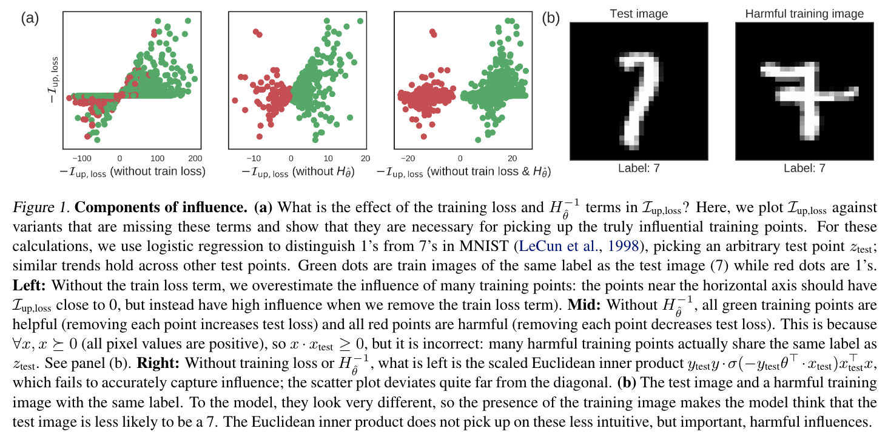

# Matplotlib
Author: [@Reed Qiuu](https://github.com/Iri-sated) [@Xun Liu](https://github.com/AntiQuality)

## 画图前的准备
#### 字体
在规范论文写作中，通常绘制矢量图（使用pdf格式导出），选取 Times New Roman 字体并将字体嵌入。

``` python
from matplotlib import rcParams

rcParams['font.family'] = 'serif'
rcParams['font.serif'] = ['Times New Roman'] + rcParams['font.serif']
matplotlib.rcParams['pdf.fonttype'] = 42
matplotlib.rcParams['ps.fonttype'] = 42
```

#### 色彩配置方案
通常一篇文章中的图，选取协调一致的绘图风格和色彩，尤其是同时使用`tikz`，`matplotlib`，`ppt`等多种绘图工具时。可以依次定义：
+ 整体风格（包括线条样式等）
+ 指定常用颜色的色彩
+ 连续的色彩变换

``` python
# 风格
canva_style = "seaborn-v0_8-muted"
plt.style.use(canva_style)

# 指定常用颜色
color_map = matplotlib.colors.get_named_colors_mapping()
color_map["red"] = "#F47F72"
color_map["lightred"] = "#F6B3AC"
color_map["green"] = "#8DD2C5"
color_map["lightgreen"] = "#BAE3DC"
color_map["blue"] = "#7FB2D5"
color_map["lightblue"] = "#B3D1E7"
color_map["orange"] = "#F7B76D"
color_map["lightorange"] = "#FCD4A1"
color_map["purple"] = "#BFBCDA"

# 色彩映射
colors = [(0, "lightgreen"), (0.3, "green"), (0.6, "blue"), (1, "purple")]
cmap_name = "custom_cmap"
custom_cmap = LinearSegmentedColormap.from_list(cmap_name, colors)
```


## 基本设置
#### 图的创建与组图的布局
子图的构建有多种方式，以论文 [Understanding Black-box Predictions via Influence Functions](http://arxiv.org/abs/1703.04730) 为例：
+ 若多张图片相关性不大，一般通过是分别插入tex后使用`subcaption`等包依次编号为(a),(b),(c)等，这样的好处是每张子图可以单独添加图注，并且便于在latex中排版整理。例如下方的组图(a)和(b)。
+ 若多张图片有强关联性，通常将他们绘制为一张图，优点是可以有完全统一的风格，包括字体和大小、线条粗细和形状等，并可以共享图例。例如下方的图(a)中左、中、右三幅图。



`matplotlib`中提供了多种布局的方式，操作性最好的方法是通过`gridspec`构建一个虚拟的“格子画布”，通过指定每张子图占据哪些“虚拟格子”来精确控制他们的位置和大小，并可以为图例、标题等全图元素留出空间。

``` python
import matplotlib.gridspec as gridspec
# 创建一张宽为12，高为4的图
fig = plt.figure(figsize=(12, 4),constrained_layout=True)
# 构建一个8行，14列的虚拟格子
gs = gridspec.GridSpec(8, 14, figure=fig)
# 第一张图（第一组坐标轴）占据第1至7行，第0至3列（从0开始计数）
axs1 = fig.add_subplot(gs[1:, :4])
# 第二张图占据第1至7行，第5至8列
axs2 = fig.add_subplot(gs[1:, 5:9])
# 第二张图占据第1至7行，第10至13列
axs3 = fig.add_subplot(gs[1:, 10:])
```

上述代码最终实现为下图，留出了最上方红色的公共空间，并在每个子图之间保留了白色的空隙。
*注：下图也是用`matplotlib`绘制，可通过`imshow`实现。*


#### 子图的基本元素
针对不同的图片场景，我们通常设置不同的图片基本元素。
##### 网格线
需要读取每个点的具体数值时，通常绘制网格线。例如，绘制三种不同网络在三个具体任务上的分类准确率，采取横向柱状图，此时添加纵向的网格线以方便估计具体数值。

``` python
def GRID_SET_VOID(axs):
	axs.grid(True, axis='x')
	axs.grid(True, axis='y')
	axs.set_axisbelow(True)
```


##### 背景颜色
一般设置为白色

``` python
def BACKGROUND_SET_VOID(axs):
	axs.set_facecolor('white')
```

##### 图边框和坐标轴
不同的图需要不同的边框和坐标轴，需要视具体情况而定：
1. 实验数据的绘图如折线图、柱状图等需要保留坐标轴和左、下边框（下左图）
2. 具有两个y轴的图片可能需要保留左、右边框分别用作两个y轴（下中图）
3. 示意图通常不需要保留坐标轴（下右图）

``` python
# 需要保留的边框在相应行前加注释
def AXS_SPINES_REMOVE_VOID(axs):
	axs.spines["top"].set_visible(False)
	axs.spines["bottom"].set_visible(False)
	axs.spines["left"].set_visible(False)
	axs.spines["right"].set_visible(False)

# 需要保留的坐标轴在相应行前加注释
def AXS_REMOVE_VOID(axs):
	axs.yaxis.set_visible(False)
	axs.xaxis.set_visible(False)
```


## 开工！画图
#### 常用画图函数
在AI科研中最常用的函数包括以下六个，常用设置的参数已列出，细节的配置参数可查阅文档。3D作图函数更加复杂，在此处跳过。

| 函数名称      | 作用          | 参数                                                                                          |
| --------- | ----------- | ------------------------------------------------------------------------------------------- |
| `bar`     | 柱状图         | `x`，`height`y值，`width`柱宽度，`bottom`y轴基线，`color`，`edgecolor`，`align`对齐方式，`hatch='/'`阴影标记      |
| `barh`    | 水平方向柱状图     | 与`bar`类似，注意此时`height`和`width`含义                                                             |
| `plot`    | 添加辅助线或绘制折线图 | `x`，`y`，`color`，`label`，`linewidth`线条粗细，`linestyle`线条风格（实线、虚线等），`marker`点形状，`markersize`点大小 |
| `scatter` | 添加单点或绘制散点图  | `x`，`y`，`color`，`label`，`marker`，`markersize`，绘制大量散点时可用`colormap`来控制颜色实现渐变效果                |
| `text`    | 标注文字        | `x`，`y`控制文本位置，`s`文本内容，`fontsize`字体大小                                                        |
| `imshow`  | 嵌入图片或绘制热图   | 功能非常灵活，可参考[教程](https://blog.csdn.net/qq_41813454/article/details/136138291)                 |

#### 坐标轴的设置
基本操作：根据需要合理控制坐标轴的范围、标注的值、每个值对应的标签，并设置坐标轴的名字和子图的标题。

``` python
# 以x轴设置为例
axs.set_xlim(0, 1)  # 设置x轴范围为（0，1）
axs.set_xticks([0,0.5,1])  # 设置x轴在0，0.5和1处标注刻度
axs.set_xticklabels(['a','b','c'])  # 设置这三处刻度显示为a，b，c
axs.set_xlabel('Task',fontsize=16)  # 将x轴命名为Task，字体大小16

# 对y轴进行类似的设置
# ...

# 设置这幅子图的元素
axs.legend()  # 给出子图的图例（详见图例一节）
axs.set_title('Accuracy',fontsize=24)  # 子图命名为Accuracy，字体大小24
```

进阶操作1：非线性刻度和科学计数法。
+ 方法一：在外部预先完成计算，传入Matplotlib画图后，手动修改坐标刻度
+ 方法二：使用`ticker`修改坐标轴格式

``` python
import matplotlib.ticker as ticker
formatter = ticker.ScalarFormatter(useMathText=True)

# 启用科学计数法
formatter.set_scientific(True)
formatter.set_powerlimits((-1, 1))
axs.xaxis.set_major_formatter(formatter)
axs.yaxis.set_major_formatter(formatter)
```

进阶操作2：双y轴图片。有时需要将两个相关的变量表示在同一副图上，但二者的值差距很大，就需要对于公用一个x轴并使用两个y轴。最典型的案例是在一张图上使用柱形图表示变量 $X$ 的分布情况，并用折线图展示 $X$ 的累积分布曲线。

``` python
# axs_twin与axs共用一个x轴
axs_twin = axs.twinx()
```
需要注意的是，我们先前设置的基本元素，例如网格线、边框都是依赖于坐标轴对象`axs`的。引入一组新坐标轴`axs_twin`后我们需要对它也进行类似的设置。双坐标轴图的示例可参考上文。

#### 图例
若绘制全局图例，需要先从子图中收集`handles`和`labels`，并移除其中重复的部分。

``` python
handles, labels = axs.get_legend_handles_labels()
# 移除每个子图中重复的部分
# ...
```

用如下方法绘制全局的图例，可以充分利用先前通过`gridspec`留出的公共空间。

``` python
fig.legend(handles,          # 每个图上的“元素”，如点、线、柱形
		   labels,           # 每个“元素”对应的标签
		   loc=(0.25,0.9),   # 图例的x，y坐标
		   ncol=8,           # 每行显示的图例个数
		   frameon=False,    # 图例的外边框（置于公共部分时去除较好）
		   fontsize=16)      # 图例字体大小
```

下图使用了*组图的布局*一节中图片所示的网格，给出一个设置全局图例的示例。其中使用了介绍的各类技巧：
1. 多张子图的布置：预留子图之间的合理间隔和图例的公共空间
2. 网格线、背景和边框
3. `scatter`和`plot`函数的绘图：颜色、点样式、点大小
4. 坐标轴的设置：坐标轴范围、刻度和标签，子图的标题
5. 在预留空间布置全局图例


#### 导出
视情况为图片添上标题。通常将图片导出为`pdf`格式来获得矢量图。

``` python
plt.title('Title')
plt.show()
fig.savefig('output.pdf', dpi=300, bbox_inches='tight')
```